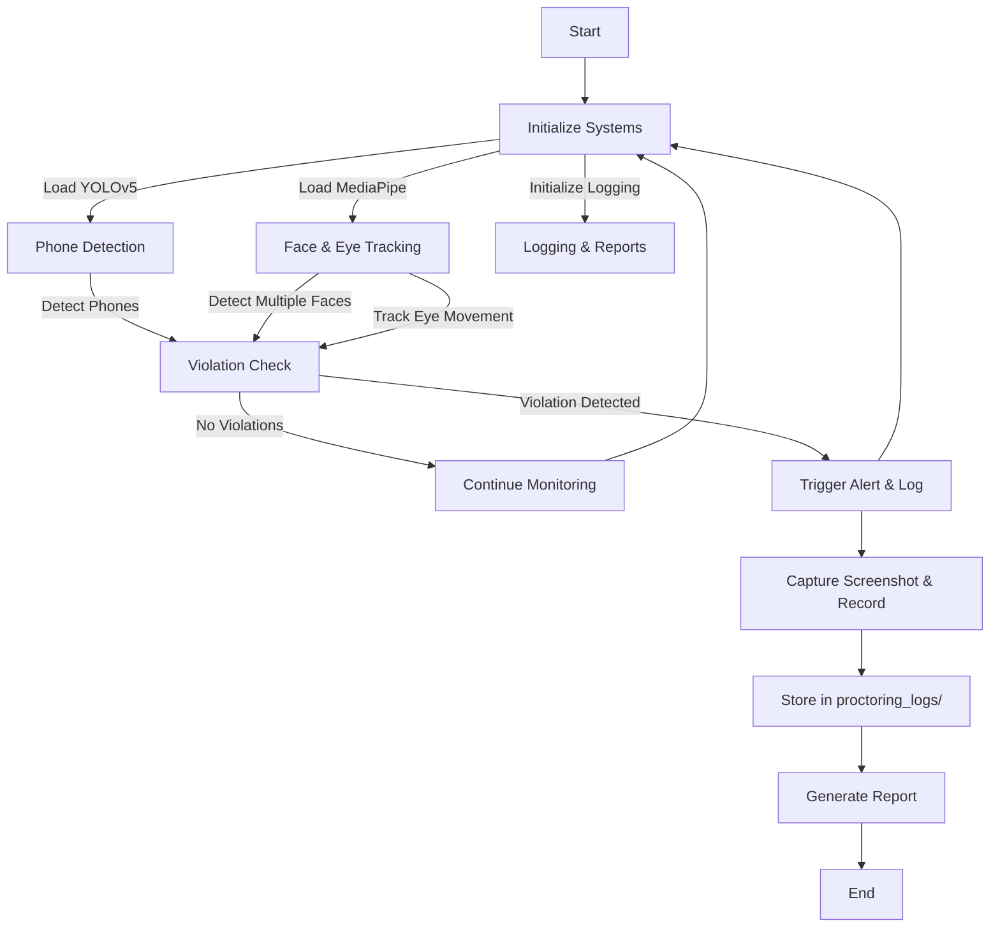

# 📌 Advanced Proctoring System  

  
  
  

## 🚀 Overview  
The **Advanced Proctoring System** is an AI-powered tool designed to **monitor online exams** by detecting:  
✅ **Phones & electronic devices** using YOLOv5  
✅ **Face absence & multiple faces** to prevent impersonation  
✅ **Eye tracking & looking away detection** using MediaPipe  
✅ **Real-time alerts, logging, and violation tracking**  

## 🛠️ Features  
✔️ **Real-time monitoring** with OpenCV  
✔️ **YOLOv5-based phone detection** (optimized for multiple classes)  
✔️ **Face & eye detection** with Haar cascades  
✔️ **Live audio alerts for violations**  
✔️ **Automated logging & violation reports**  
✔️ **Cross-platform compatibility** (Windows, Linux, macOS)  

## 🔄 System Flowchart  

## 📜 Logging & Reports  
📝 **Violation logs** are stored in the `proctoring_logs/` folder.  

## 📌 Future Improvements  
- 🔍 **Enhance accuracy** with deep learning-based face tracking  
- 🎙️ **Voice detection** for verbal cheating detection  
- 📊 **Web-based dashboard** for real-time analytics  

## 🤝 Contributing  
Contributions are welcome! Feel free to open issues or submit pull requests.  

## 📜 License  
This project is licensed under the **MIT License**.  
